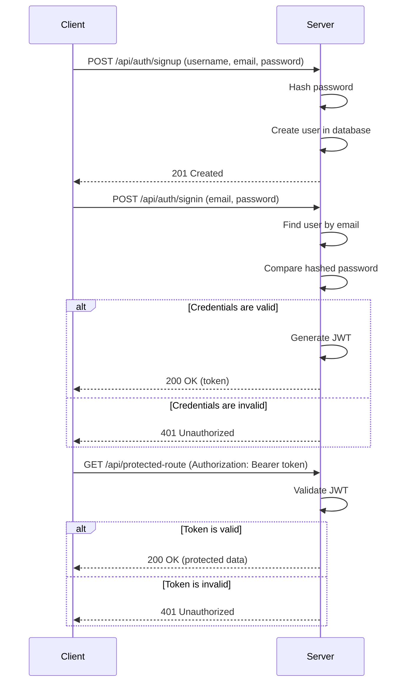

# User Authentication System Design

This document outlines the design for a complete user authentication system.

## 1. Database Schema

The database will contain a `users` table to store user information.

**Table: `users`**

| Column | Data Type | Constraints | Description |
|---|---|---|---|
| `id` | `UUID` | Primary Key, Not Null | Unique identifier for each user. |
| `username` | `VARCHAR(255)` | Unique, Not Null | User's chosen username. |
| `email` | `VARCHAR(255)` | Unique, Not Null | User's email address. |
| `password_hash` | `VARCHAR(255)` | Not Null | Securely hashed password. |
| `created_at` | `TIMESTAMP` | Not Null, Default `NOW()` | Timestamp of user creation. |
| `updated_at` | `TIMESTAMP` | Not Null, Default `NOW()` | Timestamp of last user update. |

## 2. API Endpoints

The following RESTful API endpoints will be used for user authentication.

### Sign-up

*   **URL:** `/api/auth/signup`
*   **Method:** `POST`
*   **Request Body:**
    ```json
    {
      "username": "testuser",
      "email": "test@example.com",
      "password": "password123"
    }
    ```
*   **Success Response (201 Created):**
    ```json
    {
      "message": "User created successfully"
    }
    ```*   **Error Response (400 Bad Request):**
    ```json
    {
      "error": "Invalid input",
      "details": {
        "email": "Email is already in use"
      }
    }
    ```

### Sign-in

*   **URL:** `/api/auth/signin`
*   **Method:** `POST`
*   **Request Body:**
    ```json
    {
      "email": "test@example.com",
      "password": "password123"
    }
    ```
*   **Success Response (200 OK):**
    ```json
    {
      "token": "your_jwt_token_here",
      "userId": "user_id_here"
    }
    ```
*   **Error Response (401 Unauthorized):**
    ```json
    {
      "error": "Invalid credentials"
    }
    ```

## 3. Frontend Structure

The frontend will consist of two main components for authentication: a sign-up form and a sign-in form.

### Sign-up Form

*   **Fields:**
    *   `Username`: Text input, required.
    *   `Email`: Email input, required, must be a valid email format.
    *   `Password`: Password input, required, minimum 8 characters.
    *   `Confirm Password`: Password input, required, must match the password field.
*   **Validation:**
    *   All fields are required.
    *   Email must be unique.
    *   Password must meet complexity requirements (e.g., length, character types).
*   **Error Handling:**
    *   Display specific error messages next to the invalid fields (e.g., "Email is already in use").

### Sign-in Form

*   **Fields:**
    *   `Email`: Email input, required.
    *   `Password`: Password input, required.
*   **Validation:**
    *   Both fields are required.
*   **Error Handling:**
    *   Display a general error message for invalid credentials (e.g., "Invalid email or password").

## 4. Session Management

We will use **token-based authentication** with **JSON Web Tokens (JWT)**.

*   **Reasoning:** JWTs are stateless, meaning the server does not need to store session information. This makes the system more scalable and simplifies the backend.
*   **How it works:**
    1.  After a successful sign-in, the server generates a JWT containing the user's ID and other relevant data.
    2.  The token is sent to the client, which stores it securely (e.g., in an `HttpOnly` cookie or local storage).
    3.  For subsequent requests to protected routes, the client includes the JWT in the `Authorization` header.
    4.  The server validates the JWT to authenticate the user.

## 5. Security Measures

The following security best practices will be implemented:

*   **Password Hashing:** Passwords will be hashed using a strong, one-way hashing algorithm like **bcrypt**. This ensures that even if the database is compromised, the passwords will not be exposed.
*   **Input Validation:** All user input will be validated on both the client-side and server-side to prevent common vulnerabilities such as Cross-Site Scripting (XSS) and SQL injection.
*   **HTTPS:** The application will be served over HTTPS to encrypt all communication between the client and server.
*   **Rate Limiting:** The sign-in endpoint will have rate limiting to prevent brute-force attacks.

## 6. Authentication Flow Diagram


